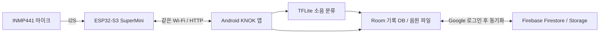

# 🔊 KNOK

> 생활 소음을 녹음하고, AI로 소리 종류를 분류하여 기록을 관리하는 Android·IoT 프로젝트입니다.

KNOK는 **ESP32-S3 SuperMini + INMP441 마이크**, **Android 앱**, **TensorFlow Lite 소음 분류 모델**, **Firebase**를 연결합니다. ESP32가 소리를 녹음하면 휴대폰이 WAV 파일을 받아 분류하고, 기록과 음원을 보관합니다.

이 문서는 **2026-10-01 기준 전달 소스와 개발 인수인계 자료**를 바탕으로 작성했습니다. 현재 개발 기준본이며, 실제 장치 동작·Android 빌드·클라우드 설정 검증은 남아 있습니다.

## 📖 프로젝트 소개

- **프로젝트명**: KNOK
- **목표**: 소음 발생 기록과 음원을 함께 관리하고, 소리 종류를 확인할 수 있도록 돕기
- **사용 환경**: Android 휴대폰, ESP32 외장 마이크, 같은 Wi-Fi 네트워크
- **개발 자료**: [개발 인수인계](KNOK_개발인수인계.md)

AI는 소리의 종류를 분류합니다. 소리의 실제 발생 층이나 이웃을 특정하는 기능은 구현되어 있지 않습니다.

## ✨ 주요 기능

아래는 소스에 구현된 기능이며, 실물 검증을 완료했다는 의미는 아닙니다.

| 기능 | 설명 |
| :-- | :-- |
| 휴대폰 측정 | 휴대폰 마이크로 녹음하고, 휴대폰 가속도계로 진동을 측정합니다. |
| ESP32 수동 녹음 | 앱에서 외장 마이크 녹음을 시작·중지하고 WAV 파일을 내려받습니다. |
| 자동 녹음 | 앱이 ESP32 음량 표시값을 감시하다가 기준값 이상이면 녹음·분류·저장합니다. |
| AI 소음 분류 | ESP32에서 받은 WAV를 Android 앱의 TFLite 모델로 분류합니다. |
| 기록 관리 | 측정 기록, 메모, 분류 결과와 녹음 파일을 저장하고 확인합니다. |
| 계정·동기화 | Google 로그인과 Firebase를 이용해 사용자별 기록과 음원을 동기화합니다. |

자동 녹음은 앱이 음량 표시값 **90 이상**을 감지하면 **5초 녹음**하고, 저장 후 약 **3초 유예**를 두는 방식입니다. 앱이 감시와 녹음 명령을 담당하므로, 앱 종료 후 장치만으로 지속 감시하는 기능은 보장되지 않습니다. 현재 음량값은 기준 음압계로 교정된 dB SPL 측정값으로 확인되지 않았습니다.

## 🔗 연결 구조



AI 분류는 **휴대폰에서 실행**합니다. 휴대폰 자체 마이크·가속도계 측정은 외장 마이크 녹음과 별도 경로입니다.

## 🛠 기술 스택

| 영역 | 기술 |
| :-- | :-- |
| Android 앱 | Kotlin, Jetpack Compose, ViewModel, Coroutines |
| 로컬 저장·통신 | Room, 앱 내부 파일 저장소, OkHttp |
| AI 추론 | TensorFlow Lite, 음향 특징 추출 |
| 인증·클라우드 | Firebase Auth, Firestore, Firebase Storage |
| 하드웨어 | ESP32-S3 SuperMini, INMP441, I2S, Wi-Fi, Arduino 스케치 |
| 데이터·학습 | Python 도구, 음원 데이터셋, 학습·평가 산출물 |

현재 설정은 `minSdk 24`, `compileSdk / targetSdk 36`, Kotlin `2.2.21`, Android Gradle Plugin `8.11.0`, Gradle `9.3.1`입니다. 이 버전 조합의 빌드 호환성은 검증이 필요합니다.

## ▶️ 실행 준비

### 1. Android 앱

1. Android Studio에서 [KNOK_source](KNOK_source/) 폴더를 프로젝트로 엽니다.
2. Android SDK와 Gradle 실행용 JDK를 설정하고, `local.properties`의 SDK 경로를 현재 PC 환경에 맞춥니다.
3. Gradle 동기화 결과를 확인합니다. 소스의 Java/Kotlin target `11`과 Gradle 실행에 필요한 JDK 버전은 별도로 확인해야 합니다.
4. Android 기기 또는 에뮬레이터에서 `app`을 실행하고, 측정 기능에 필요한 마이크 권한을 허용합니다.

외장 마이크 연결은 실제 ESP32와 같은 Wi-Fi에 연결된 Android 휴대폰에서 확인합니다. 기존 [소스 README](KNOK_source/README.md)는 AI Studio 생성 템플릿이므로, 프로젝트 구조와 설정은 이 문서 및 아래 상세 문서를 우선 참고합니다.

### 2. ESP32 외장 마이크

1. 아래 표에 맞춰 INMP441을 연결합니다.
2. [녹음기 스케치](KNOK_source/esp32/KNOK_ESP32_Recorder/KNOK_ESP32_Recorder.ino)의 Wi-Fi 설정을 사용 환경에 맞춥니다.
3. Arduino IDE에서 ESP32-S3 보드 설정을 확인한 뒤 업로드합니다.
4. 시리얼 모니터를 `115200 baud`로 열어 장치 IP를 확인합니다.
5. 앱에 `http://knok-esp32.local` 또는 확인한 IP 주소를 입력하고 연결을 확인합니다.

| INMP441 | ESP32-S3 SuperMini |
| :-- | :-- |
| VDD | 3V3 |
| GND | GND |
| SCK / BCLK | GPIO12 |
| WS / LRCLK | GPIO11 |
| SD / DOUT | GPIO10 |
| L/R | GND |

WAV는 **16 kHz, 모노, signed 16-bit PCM** 형식이며, 수동 녹음은 최대 30초입니다. 장치에는 `latest.wav` 한 파일만 남으므로 다음 녹음 전에 앱으로 저장해야 합니다. 배선과 API의 자세한 설명은 [ESP32 안내](KNOK_source/esp32/README.md)를 참고합니다.

### 3. Firebase 계정·동기화

Google 로그인과 클라우드 동기화를 사용하려면 Firebase 프로젝트의 Android 앱 등록, Google 로그인 활성화, Firestore·Storage 설정이 필요합니다. `app/google-services.json`과 로그인용 SHA-1 설정을 확인하고, 제공된 보안 규칙을 적용합니다.

자세한 설정 순서는 [Firebase 안내](KNOK_source/firebase/README.md)를 참고합니다. 전달 소스에 설정 파일이 포함되어 있어도 Firebase 관리 권한과 실제 서비스 설정이 확인된 것은 아닙니다.

## 🧠 AI 분류

현재 앱 모델은 WAV의 **첫 4초**에서 음향 특징 **501개**를 추출해 다음 6개 종류로 분류합니다. 4초보다 짧으면 부족한 구간을 0으로 채웁니다.

| 라벨 | 의미 |
| :-- | :-- |
| `dragging_furniture` | 가구 끌기 |
| `footstep` | 발걸음 |
| `hammering` | 망치질 |
| `instant_impact` | 순간 충격 |
| `normal_or_unknown` | 정상·기타·불확실한 소리 |
| `vacuum_cleaner` | 청소기 |

최고 분류 확률이 `0.65`보다 낮으면 `normal_or_unknown`으로 처리합니다. 휴대폰 자체 녹음 경로에는 현재 이 WAV 분류기를 적용하지 않습니다. 모델·데이터셋과 평가 한계는 [AI 분석](KNOK_docs/ml_analysis.md)에 정리되어 있습니다.

## 📁 폴더 구조

```text
.
├── README.md                    # 프로젝트 소개와 협업 안내
├── KNOK_개발인수인계.md          # 현재 구조·문제·다음 개발 항목
├── KNOK_docs/                   # 앱·하드웨어·AI 분석과 검증 기록
├── KNOK_source/                 # 전달 ZIP에서 추출한 개발 기준본
│   ├── app/                     # Android 앱과 배포용 AI 모델
│   ├── esp32/                   # 외장 마이크 녹음 펌웨어
│   ├── firebase/                # 클라우드 설정 안내와 보안 규칙
│   ├── tools/                   # 데이터 준비·학습·예측 도구
│   ├── dataset/                 # 음원과 데이터 분할 자료
│   ├── artifacts/               # 학습 모델·평가 산출물
│   └── gradle/                  # Android 빌드 도구 설정
├── KNOK_archive_inventory.json  # 원본 압축 파일 목록·해시
├── product_demo/               # 제품 소개 영상 자료
└── logo_outro_v3/               # 로고 영상 자료
```

## 🤝 GitHub 협업 규칙

[WayMakerSchool 예시 저장소](https://github.com/WayMakerSchool/2026-example-WayMakers)의 README와 협업 예시를 참고해 다음 흐름으로 작업합니다.

1. **이슈 등록**: 작업 목적, 변경 범위, 완료 조건을 적습니다. 버그는 재현 순서와 기대 동작을 함께 기록합니다.
2. **브랜치 작업**: `main`에서 기능·수정용 브랜치를 만들고 작업합니다. 예시 저장소는 `feat/기능이름`, `fix/버그이름`을 사용합니다.
3. **커밋**: 변경 내용을 설명하고 관련 이슈 번호를 붙입니다.
4. **PR 제출**: 작업 내용과 실제 확인 결과를 적고 리뷰어를 지정합니다.
5. **리뷰·머지**: 리뷰 내용을 반영한 뒤 `main`에 머지하고 완료된 브랜치를 정리합니다.

| 커밋 타입 | 용도 | 예시 |
| :-- | :-- | :-- |
| `feat` | 기능 추가 | `feat: 녹음 목록 검색 추가 (#이슈번호)` |
| `fix` | 버그 수정 | `fix: WAV PCM 해석 오류 수정 (#이슈번호)` |
| `style` | 디자인·스타일 변경 | `style: 기록 화면 간격 조정` |
| `docs` | 문서 수정 | `docs: KNOK 실행 방법 정리` |
| `chore` | 설정·기타 작업 | `chore: 개발 환경 설정 정리` |

PR 본문에는 **관련 이슈, 변경 내용, 검증 결과, 남은 확인 사항**을 적습니다. 이슈를 해결하는 PR은 `Closes #이슈번호`를 실제 번호로 작성합니다. 기본 브랜치에 머지되면 연결된 이슈를 자동으로 닫을 수 있습니다. [예시 PR #3](https://github.com/WayMakerSchool/2026-example-WayMakers/pull/3)을 참고합니다.

KNOK의 실제 원격 저장소 주소, 팀원·역할, 프로젝트 기간은 확인 후 이 문서에 추가합니다.

## 🔎 현재 상태와 다음 작업

현재 문서화는 소스 분석 기준입니다. Android 빌드·실기기 실행, ESP32 업로드·장시간 녹음, Firebase 접속, 모델 재학습은 이번 README 작성 과정에서 수행하지 않았습니다.

우선 확인할 항목은 다음과 같습니다.

- WAV 음수 PCM 디코딩 오류와 Python·Android 음향 특징 일치 검증
- 실제 배선·펌웨어 확인과 음량값 교정
- 앱 종료 후 감시 지속 여부와 장치 녹음 파일 보관 방식
- 기록 수정·삭제 시 로컬 DB와 클라우드 동기화 충돌

구체적인 근거와 개발 순서는 [개발 인수인계](KNOK_개발인수인계.md)를 참고합니다.

## 📚 상세 문서

- [앱·인증·DB·클라우드 분석](KNOK_docs/app_analysis.md)
- [하드웨어·배선·HTTP API 분석](KNOK_docs/hardware_analysis.md)
- [AI·학습 데이터·모델 평가 분석](KNOK_docs/ml_analysis.md)
- [검증 기록](KNOK_docs/verification.md)
- [협업 구성 참고: WayMakerSchool 예시 README](https://github.com/WayMakerSchool/2026-example-WayMakers/blob/main/README.md)

구현이나 검증 상태가 바뀌면 해당 상세 문서와 이 README를 함께 갱신합니다.
